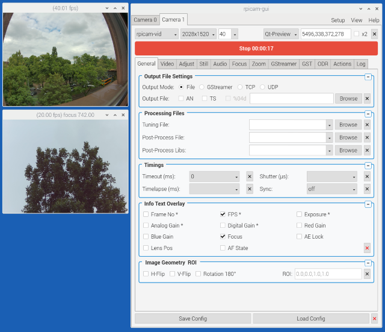

<a name="top"></a>
<div align="center">


<br><br>

[](https://github.com/Kletternaut/piStudio/releases)
[](https://www.qt.io/)
[](https://www.raspberrypi.com/)
[](https://github.com/Kletternaut/piStudio/stargazers)
[](README_DE.md)

</div>

**piStudio** is a native Qt5/C++ desktop control center for the official rpicam-apps suite. It is 100 % parameter-compatible with rpicam-apps, runs the apps in the background, generates profile files, and provides an intuitive tabbed interface with real-time preview, advanced camera settings, GStreamer streaming, AI object detection, and intelligent configuration management. Since v0.6.9 it also drives the rpicam-apps runtime control interface (`rpicam-rt` capability, Kletternaut/rpicam-apps fork, branch `feature/rt-roi`) for live parameter updates.

> **Unstable Version:** piStudio is currently in development (pre-1.0). Features, APIs, and configuration may change between releases. Tested on Raspberry Pi OS (Bookworm / Trixie) with Wayland (wayfire / labwc) and X11.

> **Display Manager / Wayland:** Depending on the display manager or Wayland compositor in use, there may be limitations in functionality and usability. These are caused by the shortcomings of the respective display manager or Wayland itself (e.g. missing support for absolute window positioning, window focus, or overlay windows) and not by piStudio.

### Features

- **Organized Tabs** – General, Output, Video, Still, Image, Focus, Zoom, Audio, GStreamer, GST Viewer, Inference, Actions, Expert
- **Collapsible UI** – collapsible groups with persistent state
- **Live Streaming** – GStreamer RTSP/UDP streaming with hardware acceleration
- **AI Detection** – Hailo/YOLO object detection with automated actions
- **Tools Tab** – Image-to-video converter with ffmpeg integration
- **Advanced Controls** – V4L2 autofocus, ROI zoom, HDR, segmentation, circular buffer
- **Network Monitoring** – Multi-tab stream viewer for remote cameras
- **i18n** – Full German/English language support with live switching

[](../resources/images/piStudio_ss2.png)

### Known Limitations

**Autofocus Lenses:** Original Raspberry Pi autofocus lenses are currently not supported. We are looking for a sponsor to provide the required hardware for development and testing. If you are interested in supporting this, please get in touch via [GitHub Issues](https://github.com/Kletternaut/piStudio/issues).

**AI Object Detection:** A Hailo-8L, Hailo-8, or Hailo-10 NPU (Neural Processing Unit) is required for AI-based object detection features. Without an NPU, the Inference and Actions tabs will not be functional.

### Quick Start

**Option A — Install via .deb package (easiest):**
```bash
wget -P /tmp https://github.com/Kletternaut/piStudio/releases/download/v0.7.3/piStudio_0.7.3_arm64.deb
sudo apt install /tmp/piStudio_0.7.3_arm64.deb
```

> Some features require additional packages (GStreamer, ffmpeg, v4l-utils, audio tools).  
> See [Optional Runtime Dependencies](../resources/docs/INSTALLATION.md#optional-runtime-dependencies) for details.

Install all optional dependencies at once:
```bash
sudo apt install -y gstreamer1.0-tools gstreamer1.0-plugins-ugly \
                    v4l-utils ffmpeg pulseaudio-utils alsa-utils
```

**Option B — Build and run directly:**
```bash
git clone https://github.com/Kletternaut/piStudio.git
cd piStudio
mkdir build && cd build
cmake ..
make -j$(nproc)
./piStudio
```

**Option C — Build and install system-wide:**
```bash
git clone https://github.com/Kletternaut/piStudio.git
cd piStudio
resources/scripts/install.sh
```

### Documentation

- [Installation Guide](../resources/docs/INSTALLATION.md) – Complete build and setup instructions
- [Parameter Reference](../resources/docs/PARAMETERS.md) – rpicam-apps parameters with links to official Raspberry Pi documentation
- [Changelog](../resources/docs/CHANGELOG.md) – Version history

### Support

- [Issue Tracker](https://github.com/Kletternaut/piStudio/issues)
- [Discussions](https://github.com/Kletternaut/piStudio/discussions)

### AI Disclosure

> **Developed with AI Assistance**  
> This project was developed with the support of AI-assisted coding tools (GitHub Copilot).  
> All code has been reviewed, tested, and integrated by the author.  
> AI tools were used to accelerate development – the creative decisions, architecture, and responsibility for the software remain entirely with the author.

---

## Disclaimer

This software is provided **"as is"**, without warranty of any kind. Use at your own risk. The author accepts no liability for any damage, data loss, hardware issues, or other consequences arising from the use or misuse of this software — see [LICENSE.md](../LICENSE.md) for full terms.

This software is licensed under the **PolyForm Noncommercial License 1.0.0**. Noncommercial use is permitted free of charge. Commercial use requires a separate license from the copyright holder. See [LICENSE.md](../LICENSE.md) for the full license text.

piStudio is an independent open-source project and is not affiliated with or endorsed by Raspberry Pi Ltd. It functionally controls the official rpicam-apps tools (100 % parameter compatibility) without being part of them. "Raspberry Pi" is a trademark of Raspberry Pi Ltd.

---

## Project Stats


---

<div align="right"><a href="#top"></a></div>
<div align="center">

**Made for the Raspberry Pi Community**

[Star this project](https://github.com/Kletternaut/piStudio) • [Fork it](https://github.com/Kletternaut/piStudio/fork) • [Share it](https://twitter.com/intent/tweet?text=Check%20out%20piStudio%20-%20Professional%20Camera%20Control%20for%20Raspberry%20Pi!&url=https://github.com/Kletternaut/piStudio)

</div>
